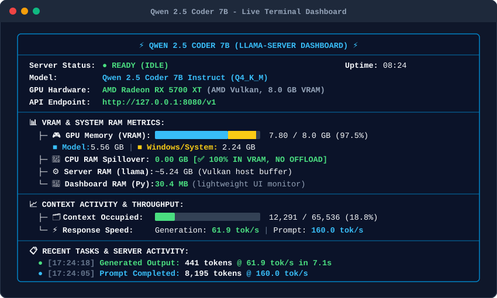

# ⚡ llama-server-dashboard

> A lightweight, zero-dependency, real-time visual terminal dashboard and monitor for `llama-server` (`llama.cpp`) with live **multi-vendor GPU VRAM partitioning** (NVIDIA CUDA / AMD Radeon / Intel Arc), **CPU RAM offload detection**, token throughput counters, and formatted event logging.

---

## 📸 Live Terminal Preview

<p align="center">
  
</p>

---

## ✨ Key Features

* 🎮 **Multi-Vendor GPU Support (NVIDIA / AMD / Intel):**
  * **NVIDIA CUDA:** High-performance direct polling via `nvidia-smi` (<20ms).
  * **AMD Radeon & Intel Arc:** Windows Performance Counter integration with automatic VRAM capacity detection.
* 📊 **Stacked Multi-Color VRAM Gauge:** Visually distinguishes memory allocation:
  * 🟦 **Cyan:** Memory occupied strictly by the Model weights and active KV-Cache.
  * 🟨 **Yellow:** Memory consumed by Windows DWM, Desktop, browsers, and background apps.
  * ░ **Gray:** Remaining unallocated GPU VRAM headroom.
* 🧠 **Zero-Spillover Detection:** Monitors whether all layers are running 100% in VRAM or spilling into system RAM.
* ⚙️ **Dual-Process RAM Tracking:** Separately displays `llama-server` process footprint (CUDA runtime or Vulkan staging buffer) and the dashboard's own tiny Python runtime (~30 MB).
* ⚡ **Live Throughput Counters:** Real-time token generation speed (`tg tok/s`) and prompt evaluation speed (`prompt tok/s`).
* 🛑 **Bulletproof Clean Exit:** Uses Windows Native Console Control Handlers (`SetConsoleCtrlHandler`) and non-blocking key polling — gracefully terminates both the dashboard and `llama-server.exe` on `Q`, `Esc`, or `Ctrl+C`.
* 🎛️ **Full `llama.cpp` CLI Passthrough:** Supports **any arbitrary parameter** accepted by `llama-server` (`--temp`, `-ngl`, `--threads`, `--jinja`, `--alias`, etc.).
* 🪶 **Zero Dependencies:** Pure Python 3 (Standard library only: `ctypes`, `subprocess`, `urllib`, `re`, `msvcrt`). No `pip install` or external packages required.

---

## 🚀 Getting Started

### Prerequisites
* **OS:** Windows 10 / 11 (64-bit)
* **GPU:** NVIDIA GeForce / RTX (CUDA), AMD Radeon (Vulkan), or Intel Arc
* **Python:** Python 3.8+
* **Backend:** `llama-server.exe` from [llama.cpp releases](https://github.com/ggml-org/llama.cpp/releases)
* Any GGUF model file (e.g. `qwen2.5-coder-7b-instruct-q4_k_m.gguf`)

---

## 💻 Usage & Command Line Options

The dashboard supports three convenient ways to launch:

### 1. Zero-Config Launch (Best-Practice Defaults)
Starts with the default model, 65k context, Q8 KV-cache, and Flash Attention:
```cmd
python dashboard.py
```

### 2. Positional Shorthand
Quickly override model, context size, and port without typing flags:
```cmd
python dashboard.py path/to/model.gguf <context_length> <port>
```
*Example:*
```cmd
python dashboard.py models/DeepSeek-R1-Distill-Qwen-7B-Q8_0.gguf 131072 8080
```

### 3. Full Native `llama-server` CLI Flags & Passthrough
Pass **any parameter supported by `llama-server.exe`**. Custom flags seamlessly override defaults and are passed directly to the engine:
```cmd
python dashboard.py -m models/Qwen2.5-Coder-7B-Instruct-Q8_0.gguf -c 131072 -ngl 33 -t 8 --temp 0.2 --jinja --alias my-coder-model
```

#### Commonly used parameters:
| Parameter | Description | Default |
| :--- | :--- | :--- |
| `-m`, `--model` | Path to GGUF model file | `qwen2.5-coder-7b-instruct-q4_k_m.gguf` |
| `-c`, `--ctx-size` | Context window size in tokens | `65536` |
| `-ngl`, `--gpu-layers` | Number of layers to offload to GPU | `99` (all layers) |
| `-ctk`, `-ctv` | KV cache quantization (`q8_0`, `q4_0`, `f16`) | `q8_0` |
| `-fa`, `--flash-attn` | Flash Attention mode (`on`, `off`, `auto`) | `on` |
| `-t`, `--threads` | Number of CPU threads | `6` |
| `-b`, `-ub` | Batch and micro-batch sizes | `-b 2048 -ub 1024` |
| `--port` | HTTP server port | `8080` |
| *Any other flag* | Forwarded directly to `llama-server.exe` | — |

---

## 🛠 One-Click Batch Launcher (`start_qwen_7b.bat`)

Place `start_qwen_7b.bat` in your model directory for instant double-click startup:

```bat
@echo off
title Qwen 2.5 Coder 7B - Live Dashboard
cd /d "%~dp0"

python dashboard.py
pause
```

---

## 📄 License

MIT License. Open source and free for personal and commercial use.
